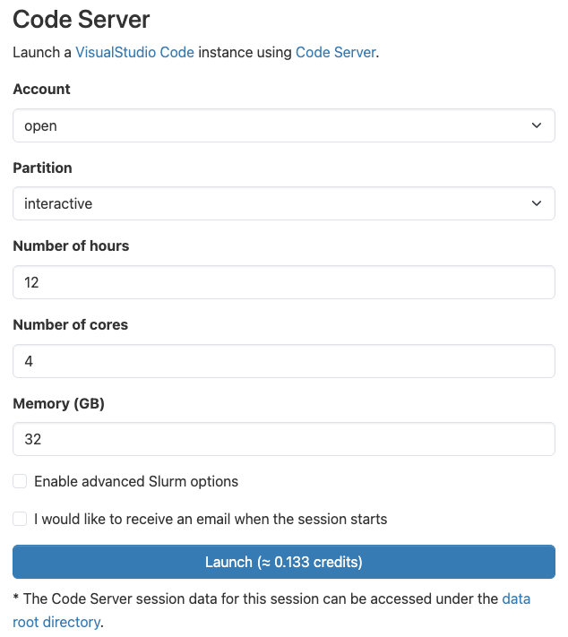
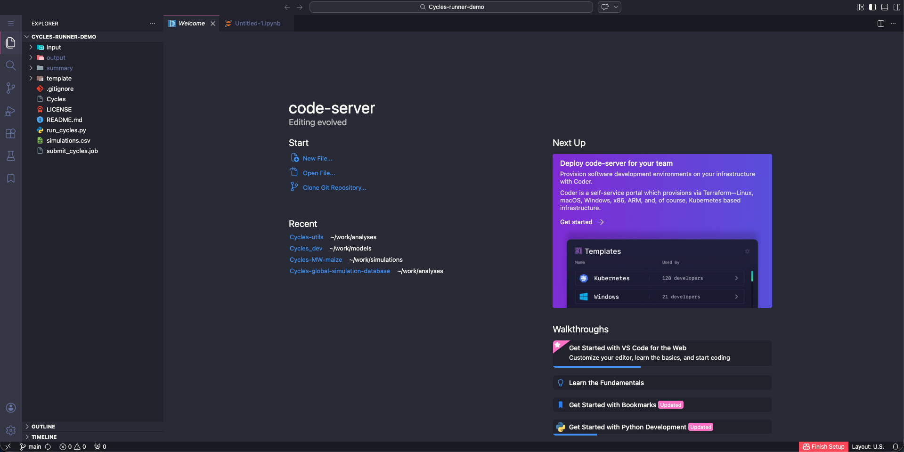
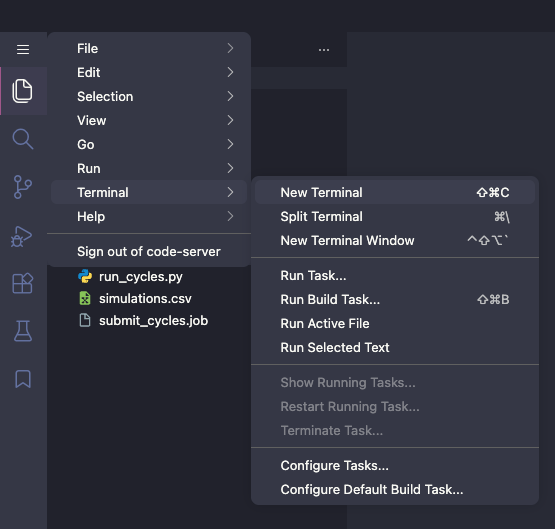

# Cycles on Penn State Roar Supercomputer

This is a guide for Penn State users to run Cycles on the Penn State ICDS Roar super computer.
The Roar supercomputer is a high-performance computing cluster that allows users to run large-scale simulations and analyses.

## Connecting to Roar

If you are familiar with using a terminal and Linux/Unix commands, the easiest way to connect to Roar is through the command line using SSH (Secure Shell).
You can use a terminal application on your local machine to connect to Roar:

```bash
ssh <userid>@submit.hpc.psu.edu
```

If you are not familiar with using a terminal and prefer a graphical interface, you can use Visual Studio Code Server from the [Roar web portal](https://portal.hpc.psu.edu/).
To use Visual Studio Code Server, got to the Roar web portal, and choose "Code Server" from the "Interactive Apps" menu.
You will be prompted to apply for an interactive session.
You can choose the number of hours you want to run the session, the number of cores, and the size of memory you want to use.
Click on "Launch" button.



Wait for the session to start, and then click on the "Click to Connect to Code Server" button.
You will be directed to the Visual Studio Code Server interface.



Within the Visual Studio Code Server interface, you can easily navigate your folders and files, and edit your input files with an easy-to-use text editor.
You can also open a terminal within the Visual Studio Code Server interface to run Cycles simulations.



## Downloading Cycles on Roar

You can directly download the Cycles release package to Roar using the `wget` command in a terminal.
Go to the [Cycles release page](https://github.com/PSUmodeling/Cycles/releases) and copy the link to the **debian** package under the "Assets" menu.
Then, in the terminal, use the `wget` command to download the package to your working directory on Roar:

```bash
wget <link to the debian package>
```

You can then unzip the package using the `unzip` command:

```bash
unzip Cycles_debian_XXX.zip
```

You can also download the package to your local machine and then upload it to Roar using the "Upload" option in the Visual Studio Code Server Explore.

## Installing Cycles-utils on Roar

The `Cycles-utils` package is a Python package that provides utility functions for running Cycles simulations and analyzing the output data.
It is highly recommended to install the `Cycles-utils` package in a virtual environment to avoid conflicts with other Python packages on Roar.
To create a virtual environment named `cycles_env` (or you can pick any name that you prefer), use the following command in the terminal:

```bash
module load anaconda/2023.09
conda create -n cycles_env
```

You can now activate the virtual environment and install the `Cycles-utils` package using the following commands:

```bash
conda activate cycles_env
conda install numpy pandas
pip install cycles-utils
```

Note that the `conda install numpy pandas` command is needed because there is a package compatibility issue in the conda environment on Roar.
You may not need this command if you are using a different virtual environment or if the issue has been resolved in the future.

Now you can use the `Cycles-utils` package in your Python scripts to run Cycles simulations and analyze the output data.
Each time you log in to Roar, you will need to activate the virtual environment using

```bash
module load anaconda/2023.09
conda activate cycles_env
```

before running your Python scripts.
You will also need to include these two lines of command in your job submission script if you are running your Python scripts on Roar using a job scheduler.
When running Jupyter notebooks on Roar, you will also need to select `cycles_env` as the kernel for your notebook to use the `Cycles-utils` package.

## Running Cycles on Roar

You can use `vim`, `emac` or `nano` to edit your input files through the terminal, or use the Visual Studio Code Server interface to edit your input files.
To run Cycles on Roar, you will need to use the terminal and run the `Cycles` executable.
Please refer to the [Getting Started](index.md#getting-started) section for detailed instructions on how to run Cycles simulations, and the [Cycles-utils](index.md#cycles-utils-python-package) section for instructions on how to run Cycles simulations using the `Cycles-utils` Python package.
